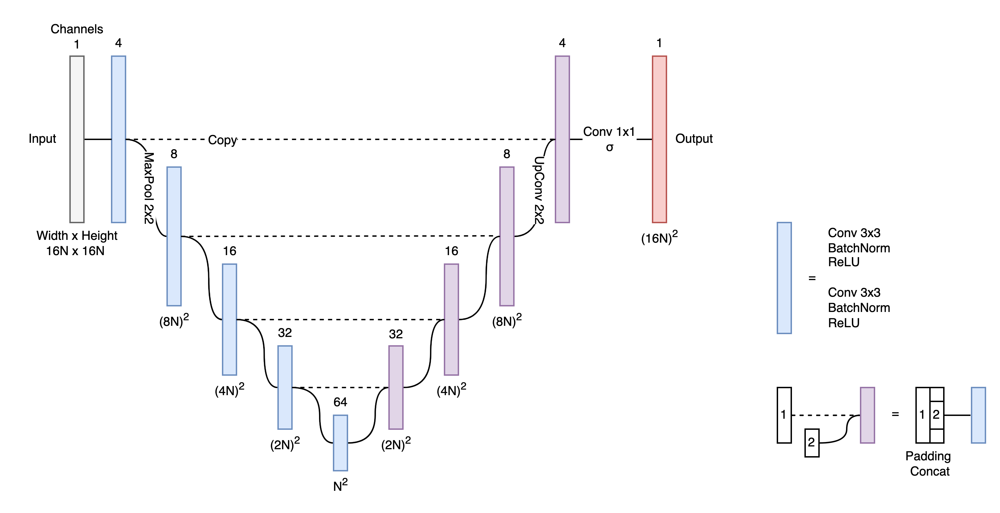

# Readme

U-Net implementation is taken from [here](https://github.com/milesial/Pytorch-UNet/tree/master/unet) and slightly modified.

For required packages check [this](./environment.yml).
Install [pytorch](https://pytorch.org/get-started/locally/).

Notebooks of interest are:

[`001-Synthetic-rotors.ipynb`](https://github.com/humanphysiologylab/nn-rotor/blob/master/notebooks/001-Synthetic-rotors.ipynb).
Generation of the synthetic dataset. Original dataset is [here](https://drive.google.com/file/d/1A1YR4p_DB3ssWP8fE33VfHCVQ-54Nh5j/view?usp=sharing).

[`015-Draw-synthetic.ipynb`](https://github.com/humanphysiologylab/nn-rotor/blob/master/notebooks/015-Draw-synthetic.ipynb).
Example of the synthetic track.

[`014-UNet.ipynb`](https://github.com/humanphysiologylab/nn-rotor/blob/master/notebooks/014-UNet.ipynb).
Training of the neural network.

[`013-illustration.ipynb`](https://github.com/humanphysiologylab/nn-rotor/blob/master/notebooks/013-illustration.ipynb).
Illustration of how neural network predicts things.

### Author
Andrey Pikunov (pikunov@phystech.edu)
